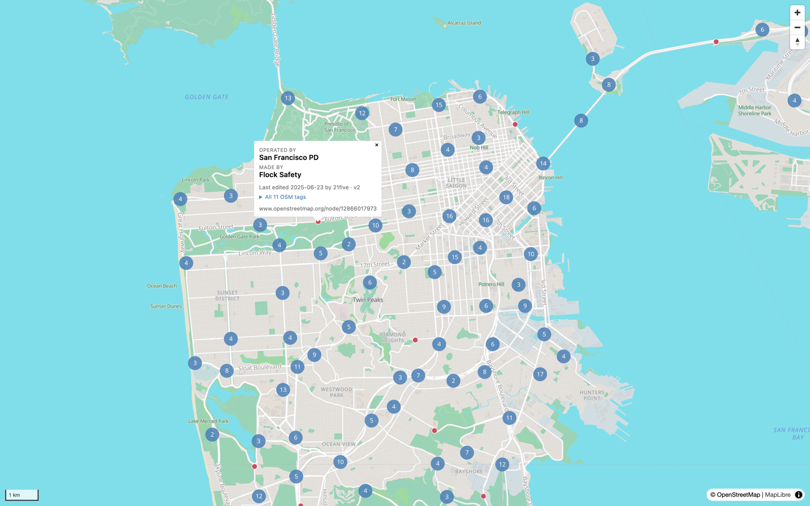

# Offline Maps

A minimalist, fully offline map viewer: one Flask process serves a vendored
[Protomaps](https://protomaps.com/) basemap rendered with
[MapLibre GL JS](https://maplibre.org/), plus every automated license-plate
reader (ALPR) known to OpenStreetMap as a clustered point layer, mirrored
locally from [DeFlock](https://deflock.org). No tile server, no CDNs, no API
keys — the browser makes **no network requests at runtime**. ("Offline" means
no *remote* calls; local requests, including dynamically querying local
data, are fine.)



## How it works

- **Basemap** — a single `.pmtiles` vector-tile archive extracted from a
  dated Protomaps planet build. Flask serves it as a static file with HTTP
  range support, and [pmtiles.js](https://github.com/protomaps/PMTiles) reads
  tile slices out of it directly in the browser — no tile server.
- **Points** — a GeoParquet loaded once into an in-memory GeoDataFrame with a
  spatial index. The page fetches the current viewport's points as GeoJSON
  (`/api/points?bbox=…`, capped at `points.max_features`) and clusters them
  client-side.
- **Popups** — clicking a point shows a DeFlock-style card (photo, operator,
  manufacturer) built from the point's own columns, then lazily fills in edit
  provenance and the full tag table from the enrichment sidecar
  (`/api/point/<osm_id>`), when present.
- **Vendored frontend** — MapLibre GL JS, pmtiles.js, the Protomaps style,
  sprites, and Noto Sans glyphs all live under `static/`; nothing is fetched
  from a CDN.

Every file under `data/` (git-ignored) is a rebuildable artifact: the
filesystem is the source of truth, and each file can be deleted and
regenerated with one command.

## Setup

Requires Python ≥ 3.12, [uv](https://docs.astral.sh/uv/), and the
[`pmtiles` CLI](https://github.com/protomaps/go-pmtiles)
(`brew install pmtiles`).

```bash
cp config.yaml.example config.yaml   # set map.center / default_zoom to your area
uv sync
bash scripts/fetch-tiles.sh          # basemap — contiguous US, full detail, ~19 GB (see below)
uv run offline-maps-sync             # points — mirror DeFlock's ALPR dataset (~3 MB)
uv run offline-maps                  # → http://127.0.0.1:5000
```

## The basemap

`scripts/fetch-tiles.sh` extracts a bounding box from a dated Protomaps
planet build with `pmtiles extract` — HTTP range requests transfer only the
tiles inside the bbox, never the 127 GB planet. Extracts keep the build's
full detail (max zoom 15), so the bounding box (`W,S,E,N`) is the size knob:

```bash
# Contiguous US (default) — ~19 GB
bash scripts/fetch-tiles.sh

# The West Coast — ~2.7 GB
bash scripts/fetch-tiles.sh --bbox=-125,32.5,-114,49

# San Francisco — ~14 MB
bash scripts/fetch-tiles.sh --bbox=-122.52,37.70,-122.35,37.83
```

If an extract is still too big, `--maxzoom` trims depth (`--maxzoom 13` cuts
the contiguous US to ~4 GB): the viewer over-zooms past whatever the archive
holds, so a shallower extract costs only the detail that lives in deeper
tiles — buildings, most notably. Upstream keeps about a week of daily
builds; the script uses the newest live one unless you pin `BUILD=YYYYMMDD`.
Use `--out` (or `OUT=…`) to write somewhere else, e.g. an external disk, and
point `tiles.file` in `config.yaml` at wherever it lands.

## ALPR data

The point layer mirrors DeFlock's worldwide dataset of ALPRs, which DeFlock
regenerates hourly from OpenStreetMap and publishes as static JSON region
tiles. `offline-maps-sync` fetches every region tile (~50 files, ~15 MB) and
writes `data/points.parquet` (~120k points, ~3 MB). Each run takes a full
snapshot and atomically overwrites the file — additions and deletions both
just fall out — so it is idempotent; re-run any time to refresh.

### Optional: full OSM metadata

DeFlock's tiles carry only a 9-tag whitelist and no edit history.
`offline-maps-sync-osm` pulls each node's complete OSM record — every tag,
plus version / timestamp / changeset / user — into a sidecar GeoParquet
(`data/points_meta.parquet`). It fetches the nodes already in `points.parquet`
*by id* straight from Overpass (a direct lookup, no bbox harvest), so it stays
fast where a global tag query would time out. The run is resumable — each
batch appends to a JSONL checkpoint, so an interrupted or rate-limited run
picks up where it left off — and `--limit N` does a quick partial run. The
viewer reads the sidecar lazily to fill popups; everything works without it.

### Optional: local photo cache

~1,400 nodes reference a photo (`wikimedia_commons`, `image`/`photo` URLs,
`mapillary`, `panoramax`) — all external links. `offline-maps-sync-photos`
downloads one size-capped image per node into `data/photos/` (a few GB) and
builds the JPEG thumbnails the popups embed, so the viewer serves photos from
its own `/photos` and `/thumbs` routes and the map stays fully offline. It is
resumable: an already-cached file is its own checkpoint, and dead links are
recorded and skipped (`--retry-failed` to retry them). Mapillary's ~480
photos need a free token — copy `.env.example` to `.env`, set
`MAPILLARY_TOKEN`, and re-run; it fills in the rest.

## Rebuilding the style (optional)

`static/styles/basemap.json` is generated, not hand-written. To regenerate it
— e.g. to switch flavors:

```bash
npm i protomaps-themes-base@4.5.0    # one-time
node scripts/build-style.mjs [light|dark|white|grayscale|black]
```

A non-`light` flavor also needs its sprite sheet vendored into
`static/sprites/` (and any missing fonts into `static/glyphs/`) from
[protomaps/basemaps-assets](https://github.com/protomaps/basemaps-assets).

## Layout

```
scripts/
  fetch-tiles.sh       extract a basemap bbox from a Protomaps planet build
  build-style.mjs      regenerate the vendored MapLibre style JSON
src/offline_maps/
  config.py            module-level settings loaded from config.yaml
  points.py            in-memory GeoDataFrame + viewport bbox queries
  meta.py              lazy per-node lookup into the enrichment sidecar
  sync.py              offline-maps-sync         DeFlock region tiles → points.parquet
  sync_osm.py          offline-maps-sync-osm     full OSM records → points_meta.parquet
  sync_photos.py       offline-maps-sync-photos  local photo cache + thumbnails
  web/
    app.py             Flask app + routes (entry point: offline-maps)
    templates/         Jinja page
    static/
      vendor/          maplibre-gl.js/.css, pmtiles.js   (vendored)
      styles/          basemap.json                      (generated)
      glyphs/          Noto Sans PBF ranges              (vendored)
      sprites/         Protomaps light sprite            (vendored)
      js/, css/        app code
data/                  git-ignored, rebuildable artifacts
  basemap.pmtiles      scripts/fetch-tiles.sh
  points.parquet       offline-maps-sync
  points_meta.parquet  offline-maps-sync-osm (optional)
  photos/              offline-maps-sync-photos (optional)
```

## Licensing & attribution

- Code in this repo: [MIT](LICENSE).
- ALPR locations and tags come from OpenStreetMap — © OpenStreetMap
  contributors, [ODbL](https://www.openstreetmap.org/copyright) — via DeFlock,
  the upstream cache the sync mirrors.
- Basemap tiles are built by Protomaps from OpenStreetMap data (also ODbL).
- Cached photos are variously licensed (Commons / Mapillary / Panoramax are
  CC; bare `image=` URLs are unknown) — fine as a local cache; attribute if
  you redistribute them.
- Vendored libraries and assets keep their own licenses: MapLibre GL JS
  (BSD-3), pmtiles.js (BSD-3), the Protomaps basemap theme (BSD-3), Noto Sans
  (OFL).
